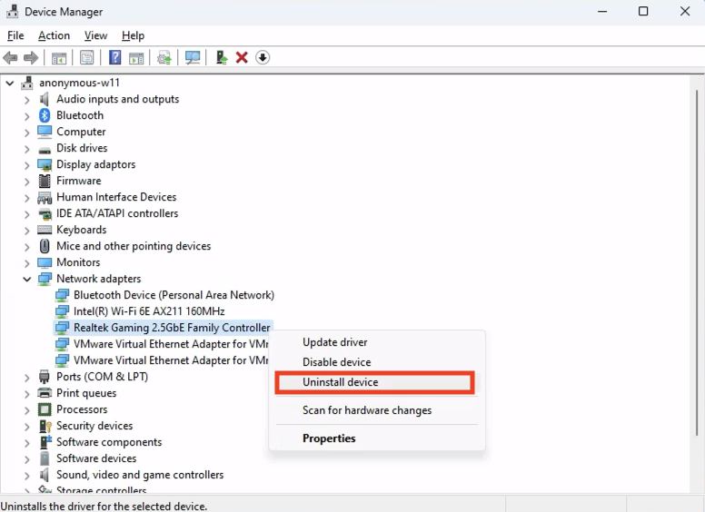
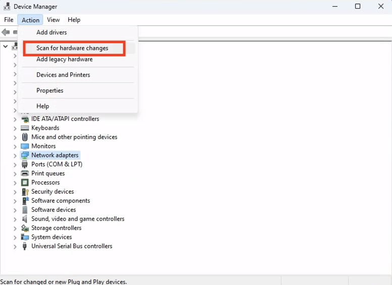
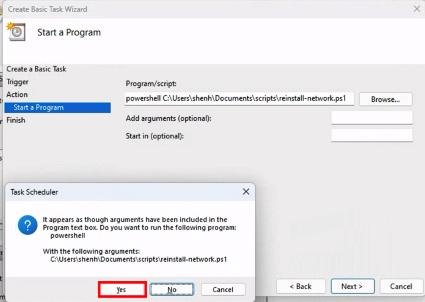
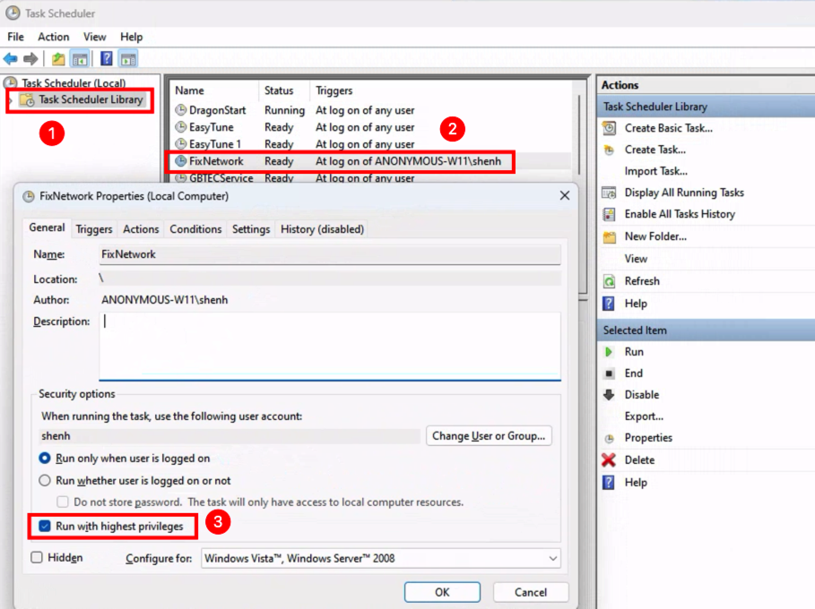

This is a very weird bug. I will describe the scenario first, then the hacky fix.

## Scenario

### Environment

- OS: Win11
- Network Adapter Name: Realtek Gaming 2.5GbE Family Controller
- Mother Board: [Gigabyte Z690 UD AX DDR4](https://www.gigabyte.com/Motherboard/Z690-UD-AX-DDR4-rev-1x#kf)

### Description

I built a new PC with [Gigabyte Z690 UD AX DDR4](https://www.gigabyte.com/Motherboard/Z690-UD-AX-DDR4-rev-1x#kf). The wifi 6 wireless adapter works fine, reaches 800+Mbps on my gigabit network; but the ethernet connection can only reach ~10Mbps.

This is super weird, the name is **Realtek Gaming 2.5GbE Family Controlleras**, the ethernet adapter should support 2.5G, and there is nothing wrong with the router.

#### Debug Process

- I plugged in a 2.5G usb C ethernet converter, it worked fine.
- When I use Ubuntu, the ethernet works fine (reach 900+Mbps).

From this debugging process, we know that the hardware should be fine. The problem most likely comes from Windows, or compatibility issue between windows and the network adapter (driver).

## Solution

### V1

The first time I got it working is by opening "Device", uninstall the device, and reinstall it.





After scanning, the network adapter is back, and the network speed is fixed (900+Mbps).

But this process has to be done every time a computer is booted.

### V2 (auto)

This powershell script basically automate the previous solution using powershell.

:::caution
It requires Adminitrator permission to run the script.
:::

Running this manually everytime is not better than the previous solution, we have to auto-run it on system starts.

The commented out lines is for debugging purpose, to see if the script has really run.

:::caution
Edit the following script to fit your scenario.

e.g. Update the `deviceName`, and log path.
:::

```powershell
# echo "start" | Out-File -Append C:\Users\user\Desktop\debug.log
# date | Out-File -Append C:\Users\user\Desktop\debug.log
# Start-Sleep -Seconds 5
$deviceName="Realtek Gaming 2.5GbE Family Controller"
foreach ($dev in (Get-PnpDevice | Where-Object{$_.Name -eq $deviceName})) {
  &"pnputil" /remove-device $dev.InstanceId
}
pnputil /scan-devices
# echo "finish" | Out-File -Append C:\Users\user\Desktop\debug.log
```

1. Press Win key, search and open "Task Scheduler"
2. Action -> Create Basic Task Wizard
3. Give a name
4. Use "When I log on" for Trigger
5. Action should be "Start a program", then fill in the script path
   1. Enter `powershell <script-path>`
      
6. Then Finish
7. Go to **Task Scheduler Library -> Your Task**, check **Run with highest priviledges**
   

Restart the computer, it should now be fixed.

If it doesn't, you may need to debug.

1. Check the variables in script
2. Run the script in powershell as Administrator and see if the network speed is normal.
3. Then restart and see
4. If it still doesn't work, uncomment the commented out code to see if the code has really run
5. If it still doesn't work, then I don't know, good luck

:::danger Blame

Microsoft, Realtek, and Gigabyte, I don't know which of you should be responsible for this bug, but this needs to be fixed. 

A gaming motherboard can't game at 10Mbps!

I personally believe Microsft/Windows should take the blame, as it works fine on Ubuntu and the driver itself should be fine. Reinstalling the device fixes the problem could induce that a wrong driver is used (override the correct driver).

This solution is hacky and inelegant, but I can't find a better solution online.

Come on, Microsoft.
:::
