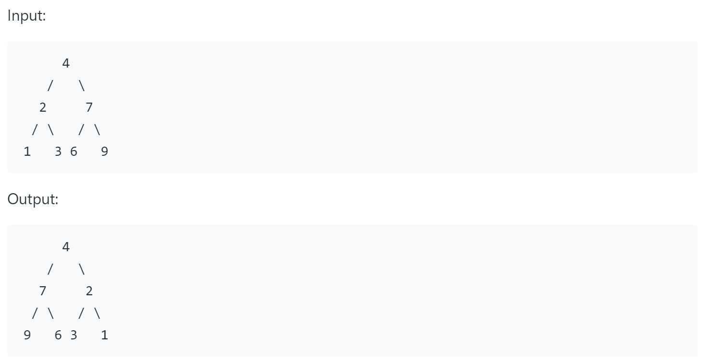

# 226. Invert Binary Tree

## Question

Invert a binary tree (horizontally).

> Max Howell: [Tweet](https://twitter.com/mxcl/status/608682016205344768)
>
> Google: 90% of our engineers use the software you wrote (Homebrew), but you can’t invert a binary tree on a whiteboard so fuck off. 



## CPP Solution

```cpp
// Definition for a binary tree node.
struct TreeNode {
    int val;
    TreeNode *left;
    TreeNode *right;
    TreeNode() : val(0), left(nullptr), right(nullptr) {}
    TreeNode(int x) : val(x), left(nullptr), right(nullptr) {}
    TreeNode(int x, TreeNode *left, TreeNode *right) : val(x), left(left), right(right) {}
};


/**
 * Runtime: 0 ms, faster than 100.00% of C++ online submissions for Invert Binary Tree.
 * Memory Usage: 8.5 MB, less than 19.30% of C++ online submissions for Invert Binary Tree.
 */
class Solution {
public:
    TreeNode* invertTree(TreeNode* root) {
        if (root) {
            TreeNode* tmp_left = invertTree(root->left);
            TreeNode* tmp_right = invertTree(root->right);
            root->left = tmp_right;
            root->right = tmp_left;
        }
        return root;
    }
};
```

## Explanation

Invert the tree from bottom to top with recursion.

For every node, invert left child and right child, and switch left and right position recursively.