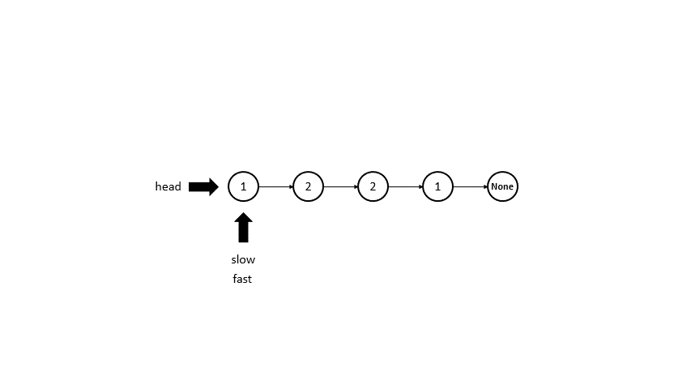

# 234. Palindrome Linked List

## Python

```python
# Version 0 makes changes to the ListNode object, which isn't a good solution

# Time: O(n)
# Space: O(n) since an extra attribute is added

# Runtime: 1048 ms, faster than 5.01% of Python3 online submissions for Palindrome Linked List.
# Memory Usage: 49.8 MB, less than 6.57% of Python3 online submissions for Palindrome Linked List.

# Definition for singly-linked list.
# class ListNode:
#     def __init__(self, val=0, next=None):
#         self.val = val
#         self.next = next
class Solution0:
    def isPalindrome(self, head: ListNode) -> bool:
        index = 0
        cur = head
        while cur.next != None:
            cur.next.prev = cur
            cur = cur.next
            index += 1
        cur1 = head
        while cur1.next != None and cur.prev != None:
            if cur1.val != cur.val:
                return False
            cur1 = cur1.next
            cur = cur.prev
        return True
            

class Solution1:
    def isPalindrome(self, head: ListNode) -> bool:
        # find mid point with fast slow pointers
        slow, fast = head, head
        while fast is not None and fast.next is not None:
            slow = slow.next
            fast = fast.next.next
        if fast is not None:
            slow = slow.next
        def reverse(head: ListNode):
            if head is None: return None
            if head.next is None: return head
            ptr1, ptr2 = None, head
            while ptr2:
                ptr3 = ptr2.next
                ptr2.next = ptr1
                ptr1, ptr2 = ptr2, ptr3
            return ptr1
        reverse_half = reverse(slow)
        while reverse_half is not None:
            if reverse_half.val != head.val:
                return False
            reverse_half = reverse_half.next
            head = head.next
        return True
```

## Golang

```go
/**
 * Definition for singly-linked list.
 * type ListNode struct {
 *     Val int
 *     Next *ListNode
 * }
*/

// Runtime: 164 ms, faster than 52.21% of Go online submissions for Palindrome Linked List.
// Memory Usage: 8.9 MB, less than 45.69% of Go online submissions for Palindrome Linked List.

func reverse(head *ListNode) *ListNode {
    if head == nil {
        return nil   
    }
    if head.Next == nil {
        return head   
    }
    var ptr1, ptr2 *ListNode = nil, head
    for ; ptr2 != nil; {
        ptr3 := ptr2.Next
        ptr2.Next = ptr1
        ptr1, ptr2 = ptr2, ptr3
    }
    return ptr1
}

func isPalindrome(head *ListNode) bool {
    slow, fast := head, head
    for ; fast != nil && fast.Next != nil; slow, fast = slow.Next, fast.Next.Next {}
    if fast != nil {
        slow = slow.Next
    }
    
    for reverse_half := reverse(slow); reverse_half != nil; reverse_half, head = reverse_half.Next, head.Next {
        if reverse_half.Val != head.Val {
            return false
        }
    }
    return true
}
```

## Animation

[Animation Power Point Source File](./animation.pptx)




