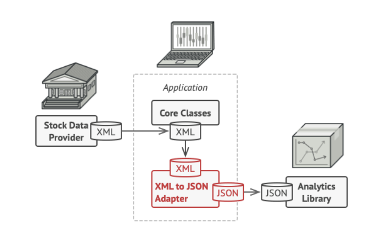

# What

> **Adapter** is a structural design pattern that allows objects with incompatible interfaces to collaborate.

Translator.

# Why

There are scenarios interfaces of different objects are different and cannot collaborate. An adapter is like a translator that enable them to use the same interface.

# Example

## Different Data File Formats

I am doing data analysis with data collected from multiple websites (in different formats, json, csv, xml, etc), I don't want to rewrite my data analysis library. Instead of making the data analysis library/algorithm support multiple data types, why don't we use adaptor/translator to make all data follow the same data structure.

## SocketIO Redis Adapter

[Redis adapter | Socket.IO](https://socket.io/docs/v4/redis-adapter/)

# Where

- When the interface of multiple objects that need to collaborate aren't the same.

# Analogy

2 people speak different languages: English and French. 

The francophone gets a French-to-English Adapter (translator) so that he can also input and output in English and communicate the English speaker.

# Reference

- [Adapter (refactoring.guru)](https://refactoring.guru/design-patterns/adapter)

