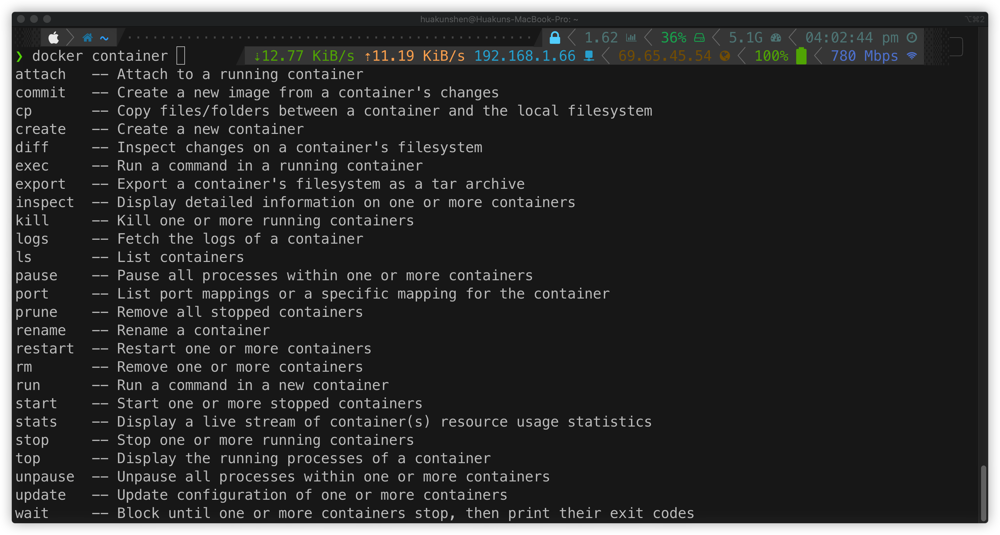

# Docker

## Cheatsheet

[Notes](./Notes/Cheatsheet.md)

[Official Cheat Sheet](./Notes/docker-cheat-sheet.pdf)

[wsargent/docker-cheat-sheet](https://github.com/wsargent/docker-cheat-sheet)

## Image

[Notes](./Notes/Image.md)

## Docker Hub

[Notes](./Notes/Docker-Hub.md)

## Container

[Notes](./Notes/Container.md)

## Dockerfile

[Notes](./Notes/Dockerfile.md)

## Volume

[Notes](./Notes/Volume.md)

## Service

[Notes](./Notes/Service.md)

## Network

[Notes](./Notes/Network.md)

## Swarm

[Notes](./Notes/Swarm.md)

## Kubernetes

[Notes](./Notes/Kubernetes.md)

## Tips

### oh-my-zsh

If you are using **zsh** as shell and **oh-my-zsh**, use the plugins `docker` and `docker-compose`.

In the `.zshrc` file, find the line `plugins=(...)`, add the two plugins.

```shell
plugins=(... docker docker-compose)
```



When a command is entered (partially), press `tab` to see available options and their description. Press tab multiple times to iterate through the options.

## Reference

[wsargent/docker-cheat-sheet](https://github.com/wsargent/docker-cheat-sheet)
