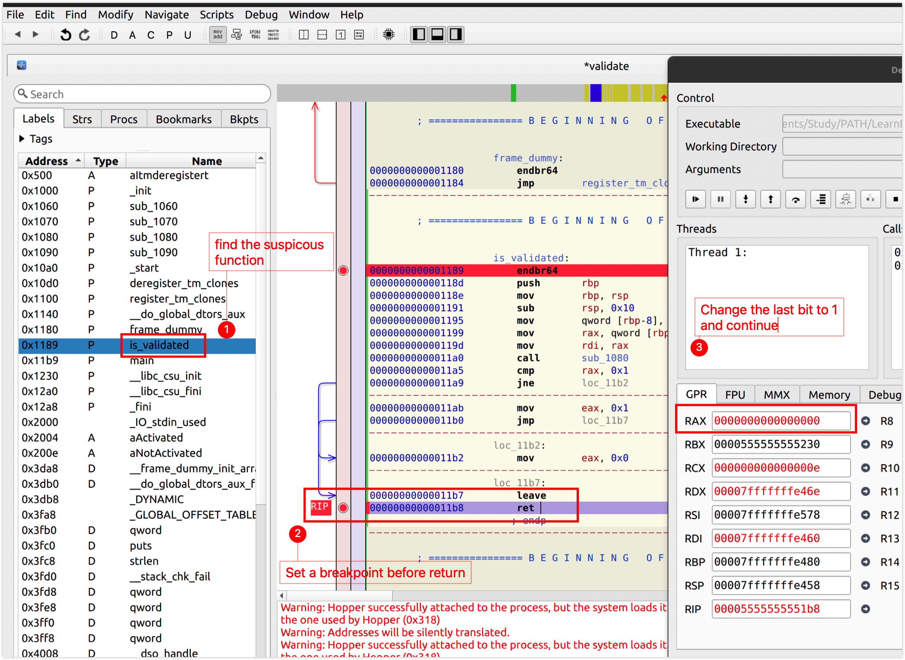
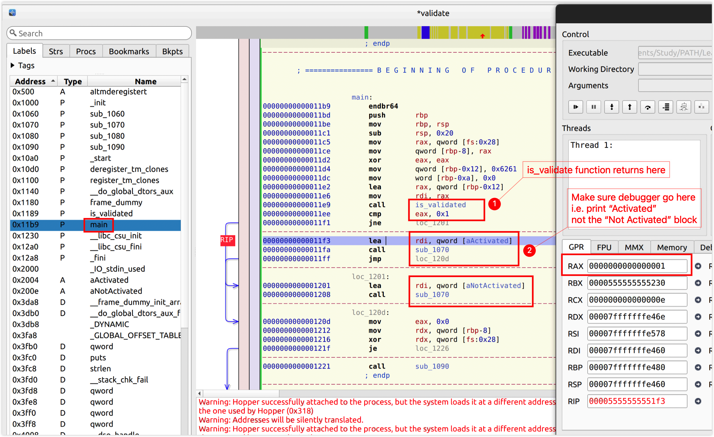
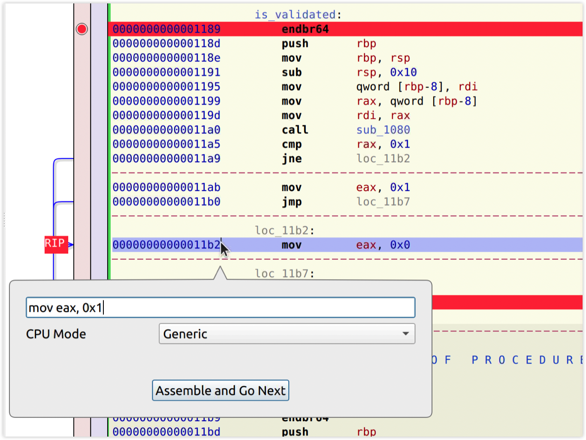

# simplest-validation (Reverse Engineering)

## Introduction

This is the first app I've ever cracked when I started learning reverse engineering.

The simple app is written by myself to simulate a super simple serial validation process.

1. The script for validation is [here](./main.c).
2. Run `make` to build the app.
3. A `validate` executable should be generated.
4. It requires no argument, and the `is_validate` function will always return `false`.
6. Our goal is to make the program print "Activated".

## Live Example

<iframe frameborder="0" src="https://replit.com/@HuakunShen/Simplest-Validation-In-C?lite=true" width="100%" height="600px"></iframe>

## Solution (amd64)

Open the executable with hopper

EAX and RAX are similar. RAX is the 64-bit version of EAX. They are the **Accumulator Register**.

EAX is the Lower 32-bit of RAX, so changing the rightmost bit of RAX also changes EAX from 0x0 to 0x1.

This process locates a position where I can crack the app. I just need to set EAX to 0x1 right before `ret`.

After the comparison `cmp` the code reaches the assembly `mov eax, 0x0`, let's change it to `mov eat, 0x1` using **Modify->Assemble Instruction**.

Then produce a new executable with **File->Produce New Executable...**

Make the generated file executable with `chmod` and run it. "activated should be printed."

