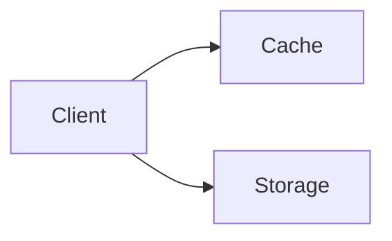
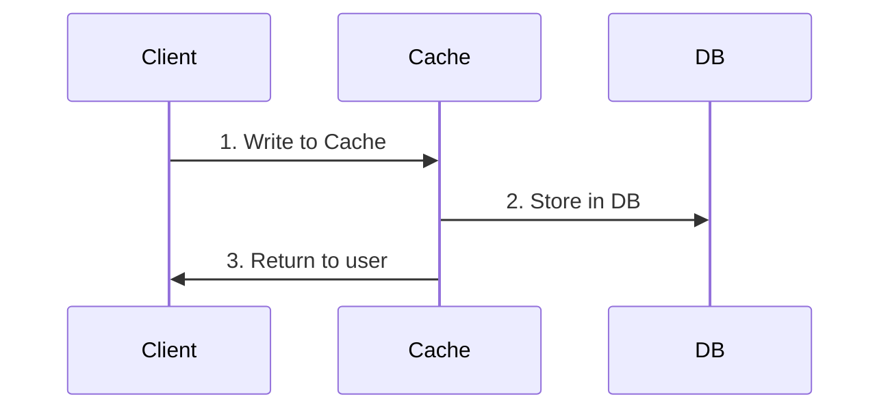
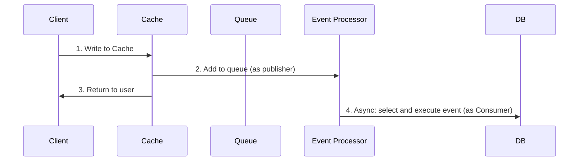
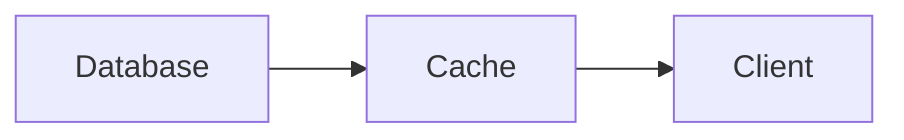

## Location of Caching

### Client (Browser) Caching

Cache data in browser.

You can do it manually, store things like user info such as profile pic or email. You don't want to request that very time.
Or some data for offline working or faster rendering.

There are libraries doing this automatically, such as Apollo GraphQL Client. It can cache GraphQL queries automatically, so that repetitive requests aren't made.

- [Caching in Apollo Client](https://www.apollographql.com/docs/react/caching/overview/)
- [Configuring the Apollo Client cache](https://www.apollographql.com/docs/react/caching/cache-configuration/)

### Server-Side Caching

[Reverse Proxy](./Proxy) can cache data.

### CDN Caching

### Application Caching

There are applications like Redis that cache in memory. [Cache Invalidation](https://en.wikipedia.org/wiki/Cache_replacement_policies) is required. There are algorithms like [LRU](<https://en.wikipedia.org/wiki/Cache_replacement_policies#Least_recently_used_(LRU)>).

### Database Caching

Databases support caching, to save time from queries.

- [MySQL Query Cache](https://dev.mysql.com/doc/refman/5.7/en/query-cache.html)
- [Postgresql Cache](https://www.postgresguide.com/performance/cache/)

- Query Level Caching
  - Use query hash as key to cache
  - Gets complicated when query is complex, changing a single cell may affect many cache.
- Object Level Caching [primer](https://github.com/donnemartin/system-design-primer#caching-at-the-object-level)

## Types of Caching

### Cache-Aside

### Write-Through

### Write-Begind (write-back)

Write data to database asynchronously. Good for situations that have super high frequency database write.

### Refresh-Ahead

Database automatically refresh recently accessed cache prior to expiration. 
- Reduced Latency
- Drawback: Have to accurately predict which items are going to be queried.

## Reference

- [Cache](https://www.cloudflare.com/en-ca/learning/cdn/what-is-caching/)
