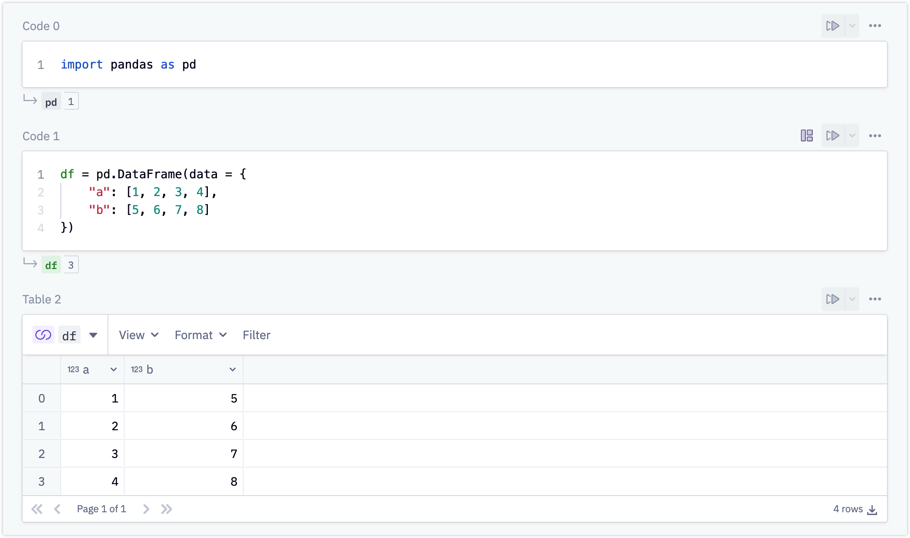
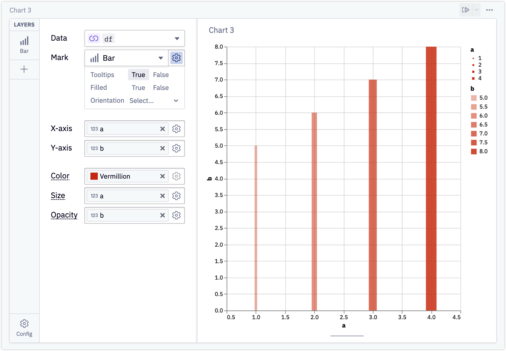
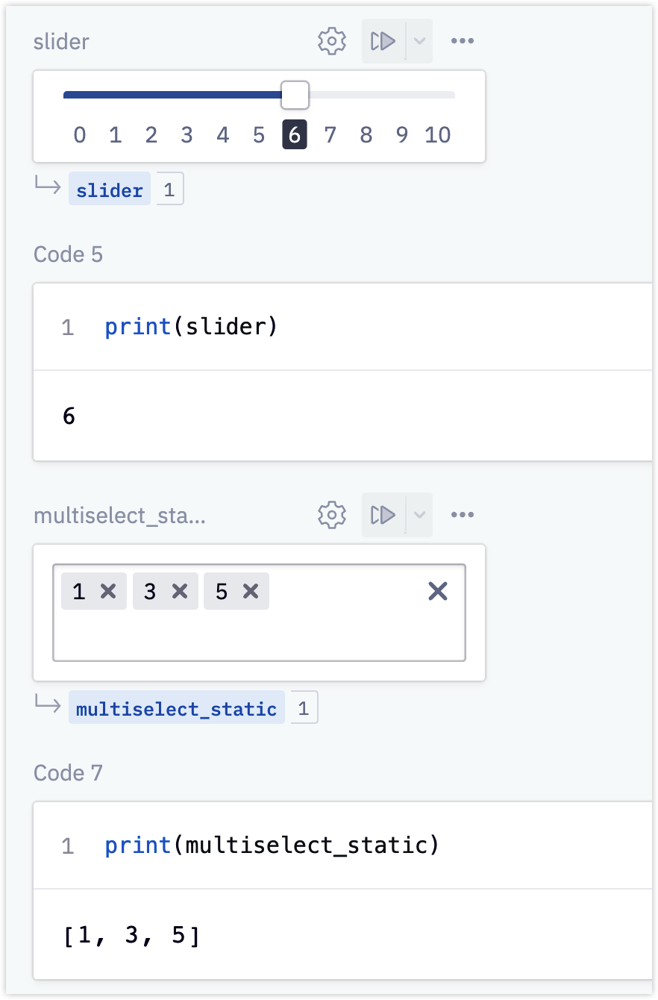
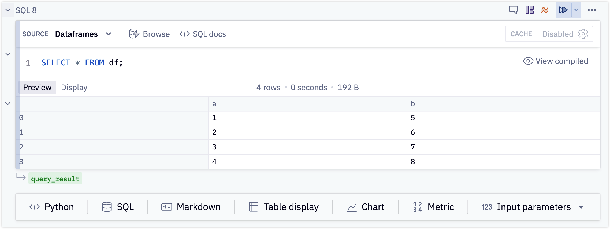
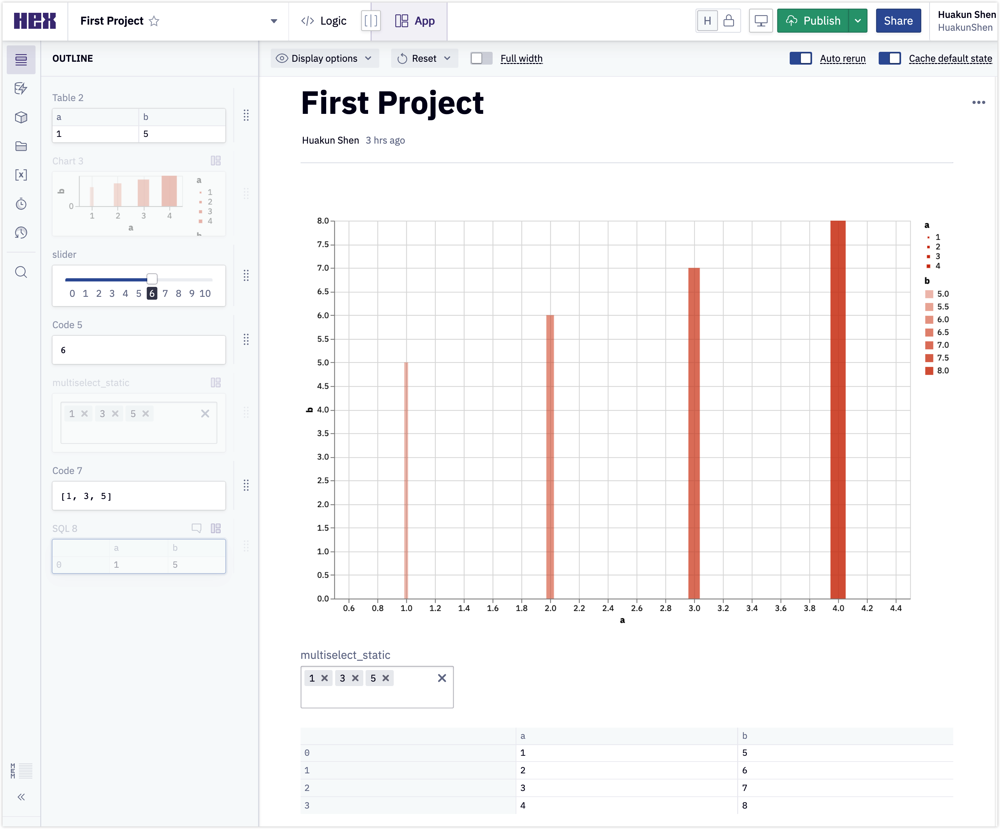
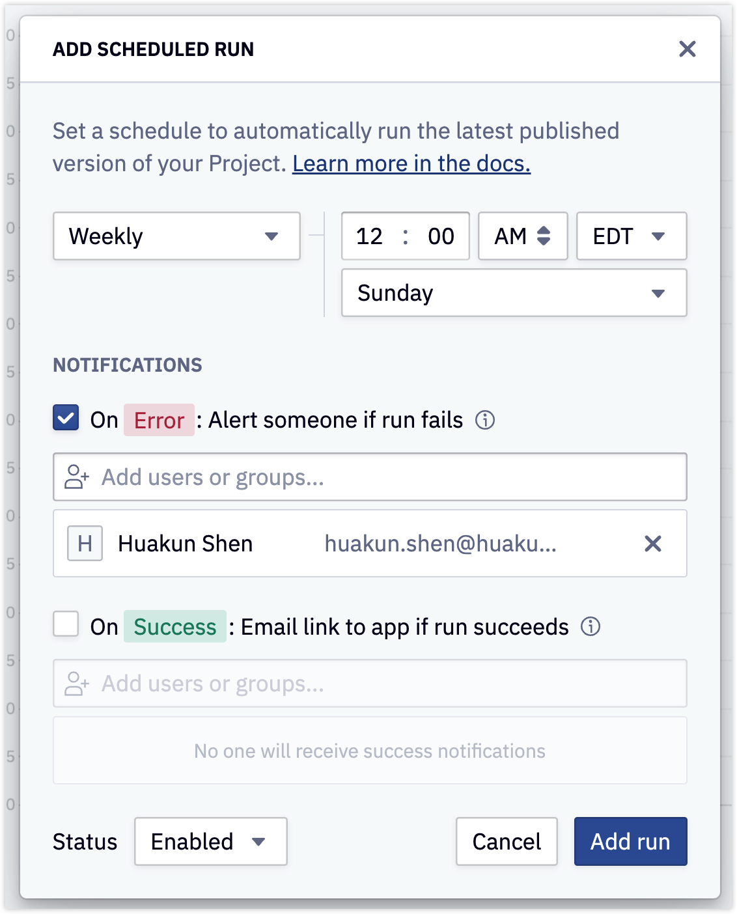

# HEX

https://hex.tech/

Drawback: It's expensive.

There are 2 main sections:

- Logic
- App

## Logic

It supports python like a jupyter notebook, and much more features are supported.

### Table Visualization

## Chart visualization with data from a data frame

### Widgets such as multiselect, slider, dropdown, and mapping to python variable

Similar features also supported in Jupiter Notebook, but requires writing code.

This allows user to pick a input and generate a custom visualization.

### SQL Support

HEX supports SQL query from SQL databases or pandas data frame.

## App

All of the functionalities I discussed above come from the Logic Section.

The **App** section displays output from **Logic**. It's like `echo=FALSE` in RMarkdown.

You may select the output to display from **Logic**.

## Scheduled Run

Cron job supported.

Job can be added hourly, daily, weekly, monthly.

Notification also supported like a CI pipeline.

Similar to my project [cron-crawler-template](https://github.com/HuakunShen/cron-crawler-template), but can be done more easily.

Since the script can be run periodically, it your data is time-sentsitive, everytime your audience open the page, the data displayed will always be up to date.

## Embed

A notebook can be embedded into other web pages using iframe.

Notion embed also supported.

## Conclusion

This is a great app as a always-up-to-date data visualization.

I will used it to display my [LeetCode Scraper](https://github.com/HuakunShen/LeetCodeScraper) result.
