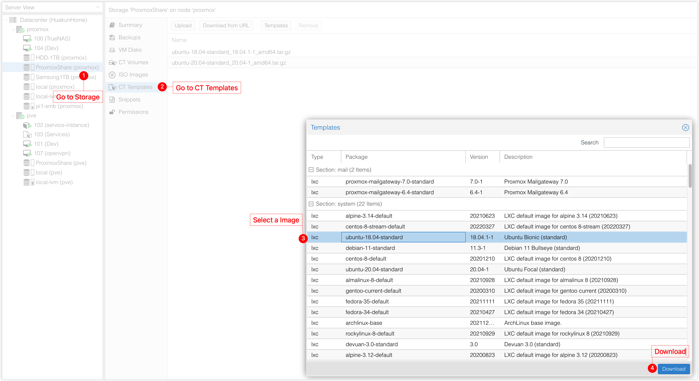
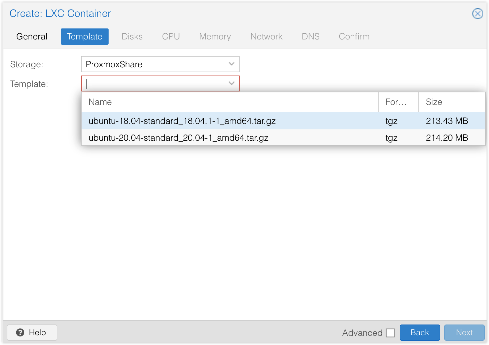

# Install OpenVPN Access Server

1. Create a LXC Container (Ubuntu or Debian)
   1. Choose template under **Template** tab
      1. LXC template can be downloaded within proxmox e.g. under a NAS, see [Add SMB Share](./SMB-Share.md).
      2. 
      3. 
   2. Choose a storage drive and allocate space (I gave it 32GB which should be too much).
   3. 1 CPU (more if you want)
   4. 2GB Memory
   5. Give it a unused static IP
   6. Create the container and login
2. Go to https://openvpn.net/vpn-software-packages/ and follow the latest instructions
3. A url and temporary password should be generated, follow further instructions https://openvpn.net/vpn-server-resources/finishing-configuration-of-access-server/

