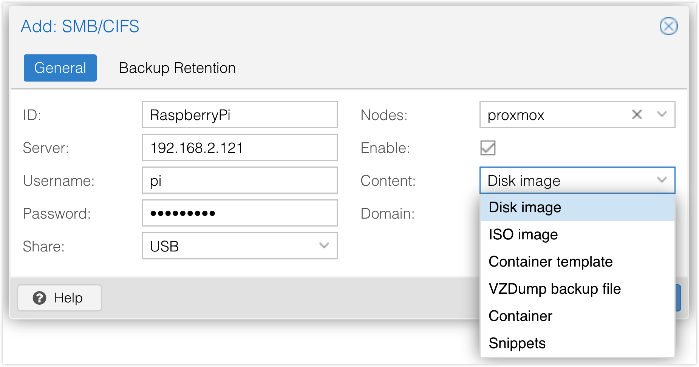

# Add an existing SMB Share

My SMB shares are hosted from a raspberry pi with [`samba`](https://ubuntu.com/tutorials/install-and-configure-samba#1-overview) and [TrueNAS](https://www.truenas.com/).

After entering server, username and password, the **Share** dropdown should contain all the available samba shares, choose one.

Content is a multi-select dropdown

You may choose all, some folders will be created on the share to store different types of data.

