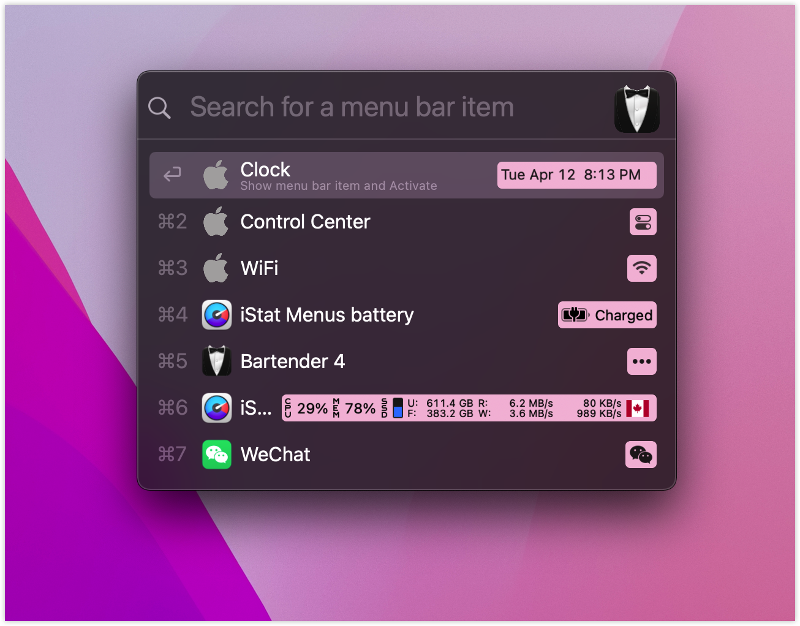
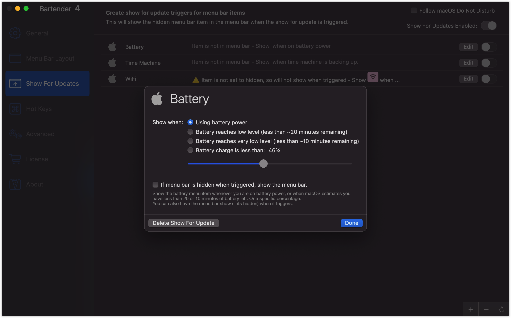

# Bartender 4

https://www.macbartender.com/Bartender4/

## Problem

MacOS has a menu bar, similar to windows and ubuntu gnome, which is convenient, but MacOS didn't do a good job as Windows 10 did.

When too many services are open and the menu bar is full, it doesn't collapse.

When the new MacBook pro came out in 2021 with a stupid and useless notch design, this problem gets worse.

Less menu items can be open because they get hidden behind the notch. The hidden menu items don't get pushed to the left of the notch, nor can you click it by moving your mouse behind the notch.

## Solution (Vanilla and Bartender)

[Vanilla](https://matthewpalmer.net/vanilla/) is a great free app which helps you to hide the long menu bar by collapsing it, but the menu bar is still too long when you expand it. Menu service item can still get hidden behind the foolish stupid garbage notch.

[Bartender](https://www.macbartender.com/Bartender4/) is a paid solution that works perfectly. The menu not only collpse, but also opens on a new line/row that doesn't locate in the original menu bar, avoiding the dumb notch.

A Alfred and Spotlight-like search bar can be open with keyboard shortcut to choose which menu bar item to open without touching your mouse.

The menu bar can be customized. Stupid menu icons such as Wechat can be kicked out of my screen.

Even conditional triggering (show icon "X" when event "Y" happens) is available which is super cool (although I don't really need it).

## Price

It costs 16 USD + Tax. I bought it because of the stupid notch.
