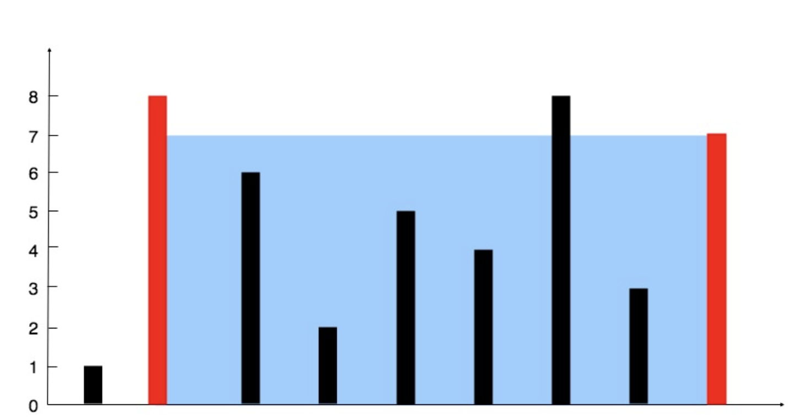

# 11. Container With Most Water



Area 由宽度和高度决定，宽度是 2 条线的差，高度是当前 2 个指针的 min。

## Brute Force

列出所有组合。

Time Complexity: $\mathcal{O}(n^2)$

Space Complexity: $\mathcal{O}(1)$

### Python Implementation

```python
class Solution:
    def maxArea(self, height: List[int]) -> int:
        m = 0
        for i in range(len(height)):
            for j in range(len(height)):
                if j > i:
                    l = j - i
                    h = min(height[i], height[j])
                    area = l * h
                    if area > m: m = area
        return m

```

### Golang Implementation

```go
func maxArea(height []int) int {
    max_so_far := 0.0
    for i := 0; i < len(height); i++ {
        for j := 0; j < len(height); j++ {
            height := math.Min(float64(height[i]), float64(height[j]))
            width := j - i
            vol := height * float64(width)
            max_so_far = math.Max(max_so_far, vol)
        }
    }
    return int(max_so_far)
}
```

## 双指针，greedy

指针分别放在两端不断向中心靠近。

Time Complexity: $\mathcal{O}(n)$ 只需 iterate 一次。

Space Complexity: $\mathcal{O}(1)$

### 如何选择移动的指针

移动的那个必须是当前的`min`。
Area 由宽度和高度决定，高度是当前 2 个指针的 min。
当指针在向中心移动时，宽度一定在缩小，若想让 area 变大，只能希望高度变高。

#### Case 1: 移动 height 为 min 的指针

移动后，宽度一定变低，如果移动的不是 height 为 min 的指针，高度永远不可能变高。如果移动的是 height 低的那个，则有可能最终达到高的那个的 height。

#### Case 2: 当 2 个指针所指高度相同时，随机选一个

**不论移动那个指针，下一步的 min height 都不可能超过当前的 height。**

不论移动的是哪个，宽度都缩小了，高度都不会变，因为下一次的 Area 由两个指针的 min height 决定，而当前 2 个指针高度相同，下次的 min height 是 at most 当前的高度。所以当前移动一次之后 area 一定变小。就算之后 area 会增加也是之后几步希望 2 个指针都移动到更高的 height 上。

既然如果 area 要变大的话 2 个指针都必然会移动，那么当前移动那个一个就不重要了。
因为这算是一个 Greedy Algorithm，我们每一步只需要 care 当前的最优解就好了。

```python
class Solution:
    """
    Runtime: 128 ms, faster than 86.21% of Python3 online submissions for Container With Most Water.
    Memory Usage: 15.4 MB, less than 35.33% of Python3 online submissions for Container With Most Water.
    """
    def maxArea(self, height: List[int]) -> int:
        m, s, e = 0, 0, len(height) - 1
        while s != e:
            area = (e - s) * min(height[s], height[e])
            if area > m: m = area
            if height[s] < height[e]:
                s += 1
            else:
                e -= 1
        return m
```

### Go Implementation

```go
func maxArea(height []int) int {
    m, s, e := 0.0, 0, len(height) - 1
    for s != e {   
        area := float64(e - s) * math.Min(float64(height[s]), float64(height[e]))
        m = math.Max(m, area)
        if height[s] < height[e] {   
            s++
        } else {
            e--
        }
    }
    return int(m)
}
```
