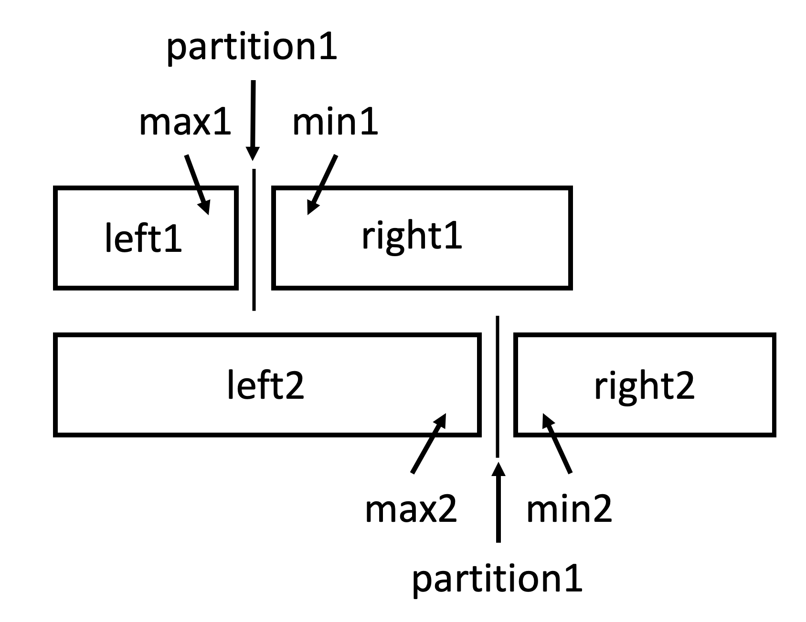

# 4. Median of Two Sorted Arrays

## Method 1: Merge 2 sorted arrays and get the median easily

```python
class Solution0:
    """
        Runtime: 104 ms, faster than 56.39% of Python3 online submissions for Median of Two Sorted Arrays.
        Memory Usage: 14.1 MB, less than 33.79% of Python3 online submissions for Median of Two Sorted Arrays.
    """
    def findMedianSortedArrays(self, nums1: List[int], nums2: List[int]) -> float:
        arr, i, j = [], 0, 0
        # merge 2 sorted array
        while i < len(nums1) and j < len(nums2):
            if nums1[i] < nums2[j]:
                arr.append(nums1[i])
                i += 1
            else:
                arr.append(nums2[j])
                j += 1
        if i < len(nums1):
            arr.extend(nums1[i:])
        elif j < len(nums2):
            arr.extend(nums2[j:])
        total_len = len(arr)
        mid = total_len // 2
        # get median depending on whether total number is odd or even
        if total_len % 2 == 1:
            return arr[mid]
        else:
            return (arr[mid - 1] + arr[mid]) / 2
```

### Analysis

Assuming `len(nums1) = m, len(nums2) = n`

**Time Complexity:** $\mathcal{O}(m + n)$

- Merge takes $\mathcal{O}(m + n)$ of time, getting median takes $\mathcal{O}(1)$ of time

**Space Complexity:** $\mathcal{O}(m + n)$

- Need to store an extra array

## Method 2: Find partition with binary search

```python
class Solution:
    """
    Runtime: 88 ms, faster than 95.63% of Python3 online submissions for Median of Two Sorted Arrays.
    Memory Usage: 14.2 MB, less than 22.35% of Python3 online submissions for Median of Two Sorted Arrays.
    """

    def findMedianSortedArrays(self, nums1: List[int], nums2: List[int]) -> float:
        nums1_len, nums2_len = len(nums1), len(nums2)
        if nums1_len > nums2_len:
            return self.findMedianSortedArrays(nums2, nums1)
        low, high = 0, nums1_len
        while low <= high:
            # select a partition in nums1
            p1 = (low + high) // 2
            # select a partition in nums2 based on the previous partition
            p2 = (nums1_len + nums2_len + 1) // 2 - p1
            max1 = -float("inf") if p1 == 0 else nums1[p1 - 1]
            max2 = -float("inf") if p2 == 0 else nums2[p2 - 1]
            min1 = float("inf") if p1 == nums1_len else nums1[p1]
            min2 = float("inf") if p2 == nums2_len else nums2[p2]
            if max1 <= min2 and max2 <= min1:         # partition satisfied
                if (nums1_len + nums2_len) % 2 == 1:
                    return max(max1, max2)
                else:
                    return (max(max1, max2) + min(min1, min2)) / 2
            elif max1 > min2:                       # binary search left
                high = p1 - 1
            else:                                   # binary search right
                low = p1 + 1
```

## Explanation

<!--  -->


Make a partition in `nums1` such that `len(left1)+len(left2)==len(right1)+len(right2)` (if total number of 2 arrays is odd, then `len(left1)+len(left2)==len(right1)+len(right2)+1`, the left partition has 1 more element than the right partition) **(Condition1)**

Partition1 is selected with binary search, partition2 is selected based on partition1 to make sure **Condition1** is satisfied.

The condition to exit is `max1>min2 && max2>min1`, in this case, everything on the left is smaller than everything on the right. Then the median must be around the 2 partitions.

- **Case 1: Total number is Odd**

  Since the total of the left partition is 1 more than the total of the right partition, the median is the max in the left partition. The max is either `max1` or `max2`.

- **Case 2: Total number is Even**

  The median would be the average of the max in the left partition and the min in the right partition, which is `(max(max1, max2) + min(min1, min2)) / 2`.

If **Condition1** is not satisfied, then keep searching for the right partition with binary search. That is, if `max1` > `min2` (partition1 too high), then binary search in `left1`, else, binary search in `right1`.

[YouTube](https://www.youtube.com/watch?v=LPFhl65R7ww&feature=youtu.be)

### Analysis

Assuming `len(nums1) = m, len(nums2) = n`

**Time Complexity:** $\mathcal{O}(\log({min(m, n)}))$

- Binary Search on the shorter array

**Space Complexity:** $\mathcal{O}(1)$

- Store constant number of variables.
