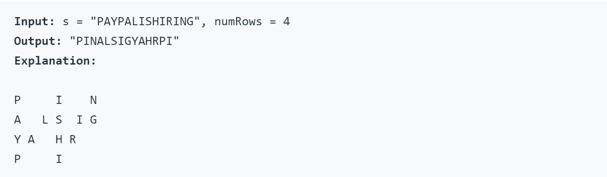
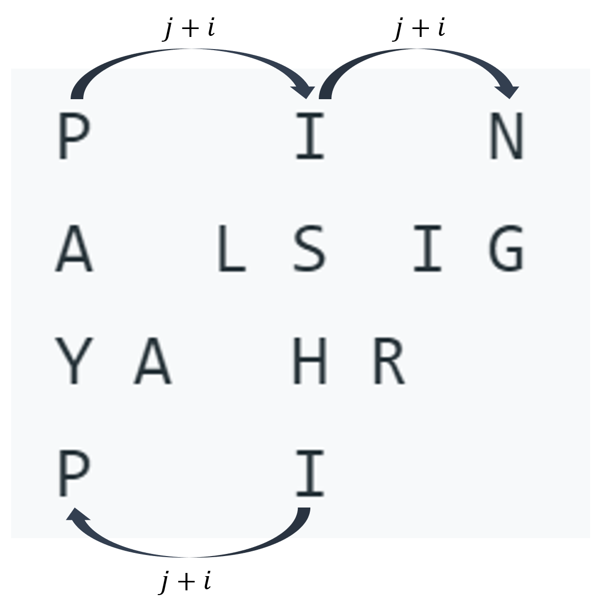
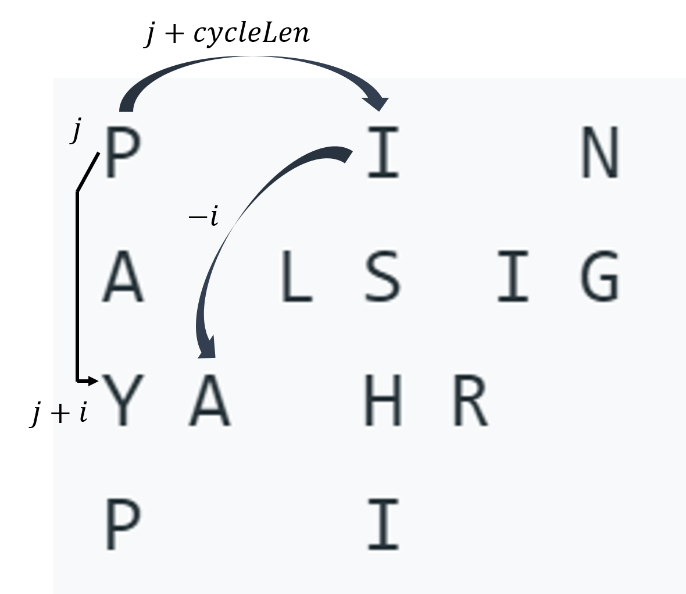

# 6. ZigZag Conversion

## Question

[Question](https://leetcode.com/problems/zigzag-conversion/)

### Example



## Trivial Solution (But Complex Implementation)

Put the string into a 2D table, and sum (concatenate) the rows where there's a letter.

```cpp
/**
 * Runtime: 64 ms, faster than 23.23% of C++ online submissions for ZigZag Conversion.
 * Memory Usage: 19.7 MB, less than 12.30% of C++ online submissions for ZigZag Conversion.
 */
class Solution
{
public:
    int num_col(int s_len, int numRows)
    {
        if (numRows == 1)
            return s_len;
        int size_v = 2 * numRows - 2;
        int num_v = s_len / size_v;
        int num_v_col = numRows - 1;
        int extra_letter = s_len % size_v;
        int extra_col = extra_letter > 0 ? 1 : 0;
        if (extra_letter - numRows > 0)
        {
            extra_col += extra_letter - numRows;
        }
        int num_col = num_v * num_v_col + extra_col;
        return num_col;
    }
    string convert(string s, int numRows)
    {
        // calculate num column
        int s_len = s.length();
        int num_col = this->num_col(s_len, numRows);
        vector<vector<char>> table(numRows, vector<char>(num_col, '\0'));
        short vertical_index = -1, horizontal_index = 0, direction = 1;
        for (unsigned int i = 0; i < s_len; i++)
        {
            // calculate horizontal index
            horizontal_index = this->num_col(i + 1, numRows) - 1;
            if (vertical_index + direction < 0 || vertical_index + direction >= numRows)
            {
                direction = -direction;
            }
            if (numRows == 1)
                vertical_index = 0;
            else
                vertical_index += direction;
            table[vertical_index][horizontal_index] = s[i];
        }
        // collect result
        string result = "";
        for (int row = 0; row < numRows; row++)
        {
            for (int col = 0; col < num_col; col++)
            {
                if (table[row][col] != '\0')
                {
                    result += table[row][col];
                }
            }
        }
        return result;
    }
};
```

#### Complexity Analysis

Assuming $n == \text{len}(s), m=numRows$

- Time Complexity: $O(m\times n)$ (Iterate through 2D Table)
- Space Complexity: $O(m\times n)$ (2D Table)

## Official Solution

[LeetCode Official Solution](https://leetcode.com/problems/zigzag-conversion/solution/)

### Approach 1: Sort by Row

#### Intuition

By iterating through the string from left to right, we can easily determine which row in the Zig-Zag pattern that a character belongs to.

#### Algorithm

We can use $\text{min}( \text{numRows}, \text{len}(s))$ lists to represent the non-empty rows of the Zig-Zag Pattern.

Iterate through $s$ from left to right, appending each character to the appropriate row. The appropriate row can be tracked using two variables: the current row and the current direction.

The current direction changes only when we moved up to the topmost row or moved down to the bottommost row.

```cpp
/**
 * Runtime: 32 ms, faster than 56.09% of C++ online submissions for ZigZag Conversion.
 * Memory Usage: 10.4 MB, less than 44.71% of C++ online submissions for ZigZag Conversion.
 */
class Solution1
{
public:
    string convert(string s, int numRows)
    {
        if (numRows == 1)
            return s;
        vector<string> rows(min(numRows, int(s.length())));
        int cur_row = 0, direction = -1;
        for (char c : s)
        {
            rows[cur_row] += c;
            if (cur_row == 0 || cur_row == numRows - 1)
                direction = -direction;
            cur_row += direction;
        }
        string result;
        for (string row : rows)
            result += row;
        return result;
    }
};
```

#### Complexity Analysis

- Time Complexity: $O(n)$, where $n == \text{len}(s)$
- Space Complexity: $O(n)$

### Approach 2: Visit by Row

#### Intuition

Visit the characters in the same order as reading the Zig-Zag pattern line by line.

#### Algorithm

Visit all characters in row 0 first, then row 1, then row 2, and so on...

For all whole numbers $k$,

- Characters in row 0 are located at indexes $k(2\cdot numRows-2)$
- Characters in row $numRows - 1$ (last row) are located at indexes $k(2\cdot numRows-2)+numRows - 1$
  - On each inner row, there are 2 letters in each cycle
- Characters in inner row $i$ are located at indexes
  - $k(2\cdot numRows-2)+i$ and $(k+1)(2\cdot numRows-2) - i$

```cpp
/**
 * Runtime: 16 ms, faster than 97.93% of C++ online submissions for ZigZag Conversion.
 * Memory Usage: 8.1 MB, less than 71.90% of C++ online submissions for ZigZag Conversion.
 */
class Solution2
{
public:
    string convert(string s, int numRows)
    {
        if (numRows == 1)
            return s;
        string ret;
        int n = s.size();
        int cycleLen = 2 * numRows - 2;

        for (int i = 0; i < numRows; i++)
        {
            // iterate through each row
            for (int j = 0; j + i < n; j += cycleLen)
            {
                // jump to the next cycle position
                ret += s[j + i]; // responsible for the outer rows and inner rows going down
                if (i != 0 && i != numRows - 1 && j + cycleLen - i < n)
                {
                    // inner rows
                    ret += s[j + cycleLen - i]; // responsible for the inner rows going up
                }
            }
        }
        return ret;
    }
};
```

#### Explanation

The `ret += s[j + cycleLen - i];` may be confusing.

##### Outer Rows (First Row/Last Row)



##### Inner Rows




#### Complexity Analysis

- Time Complexity: $O(n)$, where $n == \text{len}(s)$. Each index is visited once.
- Space Complexity: $O(n)$. For the cpp implementation, $O(1)$ if return string is not considered extra space.
