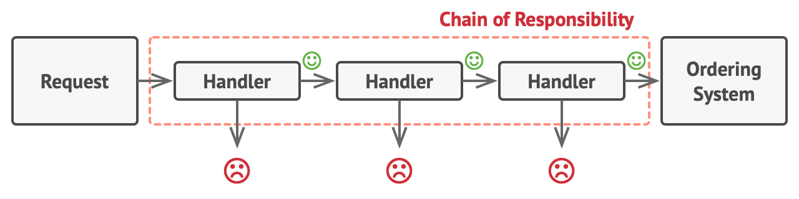
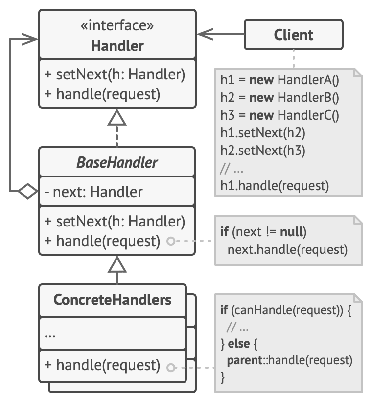

# Summary

> Chain of Responsibility is a behavioral design pattern that lets you pass requests along a chain of handlers. Upon receiving a request, each handler decides either to process the request or to pass it to the next handler in the chain.

This design pattern makes adding new feature a lot easier. This design pattern can be used to implement plugin system or middleware system which needs high flexibility on adding and removing features.





# Sample Code

[Expressjs](https://expressjs.com/) has a middleware design using the concept of Chain of Responsibility. It's special, rather than using inheritance and calling something like `next.handle()` to go to next middleware, it simply uses a `next()` function to proceed. I was curious how it makes the design synchronous, as `next()` is a callback function.

Recursion is used instead of a for loop, so callback function is still synchronous.

## Simple Express.js Style Middleware Implementation

```ts title="Simple Express.js Style Middleware Implementation"
type MiddlewareRequest = { message: string; middlewareCount: number };
type MiddlewareResponse = { success: boolean; error?: string };

type Middleware = (
  req: MiddlewareRequest,
  res: MiddlewareResponse,
  next: () => void
) => void;

class App {
  middlewares: Middleware[];
  constructor() {
    this.middlewares = [];
  }

  use(middleware: Middleware) {
    this.middlewares.push(middleware);
  }

  run(req: MiddlewareRequest, res: MiddlewareResponse) {
    const next = () => {
      const middleware = this.middlewares.shift();
      if (middleware) middleware!(req, res, next);
    };
    next();
  }
}

// initialize app (middleware container)
const app = new App();

// add middlewares
app.use((req, res, next) => {
  req.message += " (m1)";
  req.middlewareCount++;
  console.log(`middleware 1: ${req.message}`);
  next();
});

app.use((req, res, next) => {
  req.message += " (m2)";
  req.middlewareCount++;
  console.log(`middleware 2: ${req.message}`);
  res.success = false;
  res.error = "Error happens in middleware 2";
  next();
});

// how the app looks like now
console.log(app);

// initlize payload and response object
const req = { message: "Some Random Message", middlewareCount: 0 };
const res: MiddlewareResponse = { success: true };

// run the app
app.run(req, res);

// result
console.log("Results");
console.log(`\tMiddleware Count: ${req.middlewareCount}`);
console.log(`\tSucecss: ${res.success}`);
if (res.error) console.log(`\tError: ${res.error}`);

/** Console Output
 * middleware 1: Some Random Message (m1)
 * middleware 2: Some Random Message (m1) (m2)
 * Results
 *         Middleware Count: 2
 *         Sucecss: false
 *         Error: Error happens in middleware 2
 */
```

## Expressjs Style Design with a Route Handler

<details>

<summary>Sample Code</summary>

```ts
/**
 * This file demonstrates express.js-style middleware design, using Chain of Responsibility design pattern
 * Suppose we are building an app with only one route (/register)
 * Note: all middlewares in this sample code are only for /register route, for demonstration purpose only, middlewares in real life are more general
 */

type MiddlewareRequest = { body: any };
type MiddlewareResponse = { success: boolean; error?: string };

type Middleware = (
  req: MiddlewareRequest,
  res: MiddlewareResponse,
  next: () => void
) => void;

type RouteHandler = (req: MiddlewareRequest, res: MiddlewareResponse) => void; // a route handler doesn't need a next function

class App {
  middlewares: Middleware[];
  routeHandlers: Map<string, RouteHandler>;

  constructor() {
    this.middlewares = [];
    this.routeHandlers = new Map();
  }

  use(middleware: Middleware) {
    this.middlewares.push(middleware);
  }

  run(route: string, req: MiddlewareRequest, res: MiddlewareResponse) {
    res.success = true; // init with success = true
    res.error = undefined;
    const middlewares = [...this.middlewares]; // make a copy of middlewares, used as a queue/stack
    const next = () => {
      const middleware = middlewares.shift();
      if (middleware) middleware!(req, res, next);
    };
    next();
    if (res.success) {
      // middlewares did not throw any error
      const handler = this.routeHandlers.get(route);
      if (handler) handler(req, res);
    } else {
      // middlewares not successful
      console.log(`~~~~~~ Error: ${res.error} ~~~~~~`);
    }
  }

  post(route: string, handler: RouteHandler) {
    this.routeHandlers.set(route, handler);
  }
}

// initialize app (middleware container)
const app = new App();

// add parameter check
app.use((req, res, next) => {
  if (!req.body.username) {
    res.success = false;
    res.error = "Missing username in request body";
    return;
  }
  if (!req.body.password) {
    res.success = false;
    res.error = "Missing password in request body";
    return;
  }
  next();
});

// add password length check middleware
app.use((req, res, next) => {
  if (req.body.password.length < 8) {
    res.success = false;
    res.error = "Password has to be at least 8 characters";
    return;
  }
  next();
});

// add username length check
app.use((req, res, next) => {
  if (req.body.username.length < 6) {
    res.success = false;
    res.error = "Username has to be at least 6 characters";
    return;
  }
  next();
});

// register a route
app.post("/register", (req, res) => {
  console.log(
    `Registered user ${req.body.username} with password: ${req.body.password}`
  );
});

// how the app looks like now
console.log(app);

// initlize payload and response object
const req = {
  route: "/register",
  body: {
    username: "user",
  } as any,
};
const res: MiddlewareResponse = { success: true };

// run the app
app.run("/register", req, res);
// output: ~~~~~~ Error: Missing password in request body ~~~~~~

req.body.password = "pass";
app.run("/register", req, res);
// ~~~~~~ Error: Password has to be at least 8 characters ~~~~~~

req.body.username = "longusername";
app.run("/register", req, res);
// ~~~~~~ Error: Password has to be at least 8 characters ~~~~~~

req.body.password = "password";
app.run("/register", req, res);
// Registered user longusername with password: password
```

</details>

# Reference

- [My Gist Sample Code](https://gist.github.com/HuakunShen/ab8d50cbc2cb819ad21af00d27b135a9)
- https://refactoring.guru/design-patterns/chain-of-responsibility
