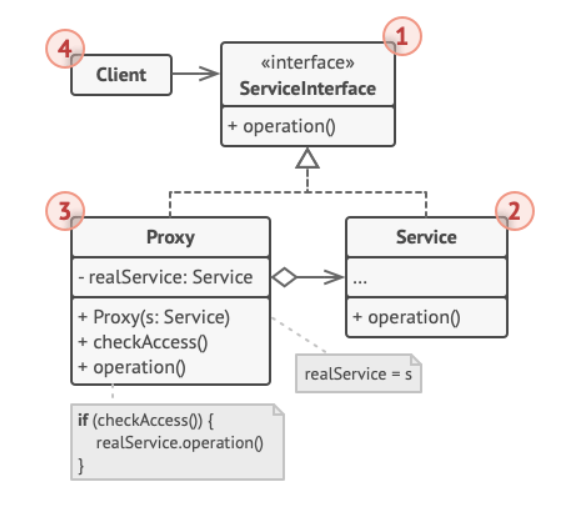

# What

> A structural design pattern that lets you provide a substitute or placeholder for another object, and allows you to insert custom logic before and after executing some code.

A proxy controls access to the original object. Instead of controlling the original object directly, a proxy sits between client and the original object, so that the request from client is intercepted and insert operations before or after moving the original object.

## Example 1

I am flying a drone with obstacle avoidance system. The system is the proxy. Even if I fly the drone towards a wall, the system will intercept my command and stop the drone.

## Example 2

Frontend frameworks like React and Vue store their local states in proxy variables using `useData` or `ref`. 

Similar to observer pattern, once the data of these variables are updated, the UI can be rerendered without refreshing the page (change the variable on UI directly as we know which variable is updated). Moreover, Callbacks watching for the updated variable are triggered.

# Why

- You may want to intercept the execution of a function and add some custom steps.
- If you want to do something before or after an operation.

Suppose you have a DB connection method `connect()` that's used everywhere in your code, and you need to do something before and after it. There may be duplicate code if you add the extra code everywhere connect is used. One solution is to use a wrapper function, but if a database service class has many db functions that require extra custom steps (such as logging) and you don't want to (not able to) modify the db functions, it makes sense to build a proxy that has exactly the same API interface as the database service class.


# How

The proxy can implement exactly the same API interface as the real object, so it can be passed so anywhere that's expecting the real object.

```python
class RealService:
  def real_service():
    """Do something"""

class LogProxyService:
	def real_service():
    logging.log("real_service called")
    realservice.real_service()
```


# Where

- Used when you need to interrupt something and insert some custom logic
- While also want to keep the same API interface (use a substitute of the real object/service).

# Analogy

Bank cards are like proxies of cash. Instead of manipulating cash, the proxy (card) pays electronic money.

Card and Cash are both like extension of money, all of them has a method `pay()`, bank + card serves as a proxy to transfer the money in a different way.

# Structure



See more detailed description at [Proxy (refactoring.guru)](https://refactoring.guru/design-patterns/proxy).

# Reference

- [Proxy (refactoring.guru)](https://refactoring.guru/design-patterns/proxy)

