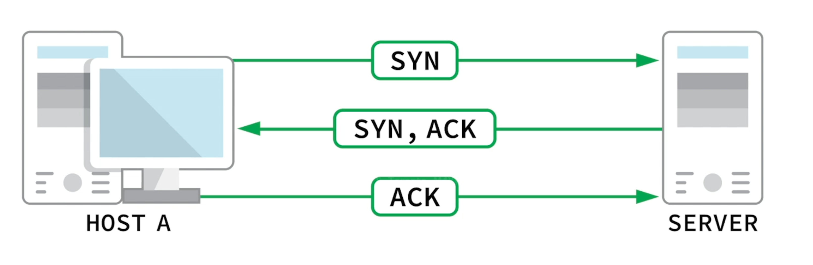

# AIG-Active Information Gathering

## DNS Enumeration

`host`: get info of a domain

```bash
host domain.com 	   # get ip
host -t mx domain.com  # for mail server		-t for type
host -t txt domain.com # for txt record
```

You can use forward look up to find ip address given domain, or

reverse loop up to find domain given ip, since a domain could possibly have subdomains in a small range of ip addresses.

## Automating Loopups

### Forward Lookup Brute Force

```bash
# Use a list of possible hostname (subdomain name)
for ip in $(cat list.txt); do host $ip.megacorpone.com; done  # find servers
```

### Reverse Lookup Brute Force

```bash
# Search in a range of ip for wanted server
for ip in $(seq 50 1000); do host 38.100.193.$ip; done | grep -v "not found"
```

## DNS Zone Transfers

Zone transfer is a database replication between related DNS servers, in which the zone file is copied from a master DNS server to a slave server.

If an admin misconfigured the zone, hacker can get a copy of the zone file by running a zone transfer against nameservers.

### Find Nameserver

```bash
host -t ns domain.com | cut -d " " -f 4
```

### Zone Transfer

```bash
host -l ns <domain.com> <dns server address>
```

## Relevant Tools

### DNSRecon

Advanced DNS enumeration script written in Python.

```bash
dnsrecon -d domain.com -t axfr		# -d for domain, -t for type of enumeration (zone transfer in this case)

# Brute force
dnsrecon -d domain.com -D ~/list.txt -t brt	# -D for file containing potential subdomains, -t brt for brute force
```

### DNSenum

DNS enumeration tool

```bash
dnsenum zonetransfer.me
```


## Port Scanning

### TCP/UDP Scanning

Use netcat (not an actual port scanner)

## TCP Scanning

#### Connect Scanning:

Rely on 3 way handshake



If handshake succeeds, port is open.

```bash
nc -nvv -w 1 -z 10.11.1.220 3388-3390		# -w for timeout, -z for zero IO (no data sent, for scanning)
```

### Nmap

### Stealth / SYN Scanning

SYN Scan doesn't complete 3-way handshake, just until the second step.

```bash
sudo nmap -sS 10.11.1.220
```

### TCP Connect Scanning

When don't have raw socket priviledges (no sudo), nmap defaults to use TCP Connect Scanning (Slower).

When scanning through proxies, Connect Scan is necessary.

```bash
nmap -sT 10.11.1.220
```


## UDP Scanning

UDP is stateless and no 3-way handshake. Different mechanism from TCP.

```bash
nc -nv -u -z -w 1 10.11.1.115 160-16	# -u for UDP scan
# How target server respond depends on how it's programmed
# If port is not open, ICMP for port not unreachable should be responded
```

This method can be unreliable when the target port is filtered by a firewall, port will be seen as open since ICMP msg is missing.

### Nmap

```bash
sudo nmap -sU 10.11.1.115		# -U for UDP Scan
```


## Network Sweeping

```bash
nmap -sn 10.11.1.1-254

nmap -v -sn 10.11.1.1-254 -oG ping-sweep.txt		# save result
grep Up ping-sweep.txt | cut -d " " -f 2 | head
```


## Masscan

Scan the entire internet in 6 min. 

`sudo apt install masscan`


## SMB Enumeration


## NFS Enumeration


## SMTP Enumeration


## SNMP Enumeration

```bash
sudo nmap -sU --open -p 161 10.11.1.1-254 -oG open-snmp.txt
```


