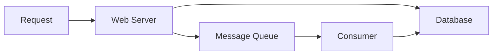

Asynchronously write data to database.

## Purpose

- Reduce request times for expensive operations
- Doing periodic job in advance (periodic data aggregation)

## Message Queue

- Redis
- Kafka
- RabbitMQ
- Amazon SQS

## Task Queues

## Back Pressure

Back Pressure limits queue size. 

## Reference

- [Introduction to architecting systems for scale](https://lethain.com/introduction-to-architecting-systems-for-scale/#platform_layer)
- [System Design Primer](https://github.com/donnemartin/system-design-primer#asynchronism)
