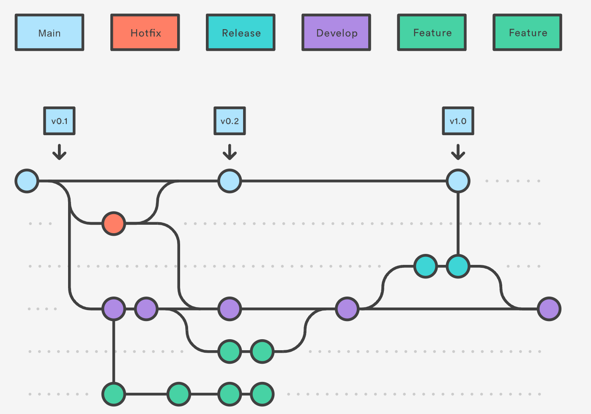

# Gitflow
> Gitflow is a list of rules to keep a repo’s history organized, and is used to make the release process, bug fixes, and feature creation easier.

## Installation
https://skoch.github.io/Git-Workflow/

## Introduction


https://www.atlassian.com/git/tutorials/comparing-workflows/gitflow-workflow


```bash
git init
git flow init  # will create develop branch

# feature
git flow feature start new-feature develop  # create branch feature/new-feature based on develop branch
# ... edit and commit any changes
git flow feature finish new-feature

# release
git flow release start new-release develop
git flow release finish new-release

# hotfix
git flow hotfix start new-fix main
git flow hotfix finish new-fix

# support
git flow support start new-support main
git flow support finish new-support

# version
git flow version  # get app version
```

## GitKraken
GitKraken has GUI support for Gitflow functionalities that's very easy to use. See [Docs]([GitKraken GitFlow](https://support.gitkraken.com/git-workflows-and-extensions/git-flow/)).


# Reference
- [Gitflow Workflow by Atlassian](https://www.atlassian.com/git/tutorials/comparing-workflows/gitflow-workflow)
- [GitKraken GitFlow](https://support.gitkraken.com/git-workflows-and-extensions/git-flow/)
- [A successful Git branching model by Vincent Driessen](https://nvie.com/posts/a-successful-git-branching-model/)
- [Gitflow Workflow](https://skoch.github.io/Git-Workflow/)


