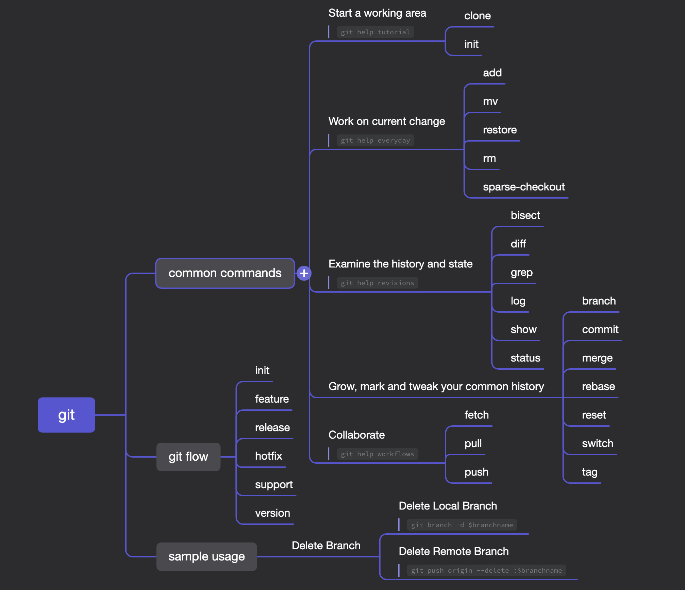

# 幕布
https://mubu.com/
## Platforms
- MacOS
- Windows
- Web

## Intro

This app is written in Chinese and there is no support for other languages as of now (Mar, 2022). So I will discuss its functionalities in Chinese.

Great Mindmap App, best choice for myself. It's not the most powerful, or has the most types of diagrams. But it's simple, light-weight, fast and easy to use. 

2种模式，大纲和思维导图。
大纲模式下支持基础Markdown排版语法，用缩进（indent）表示思维导图（树状图）的层级关系。

- `Command + /` 打开快捷键列表
- `shift+enter` 打开描述

## Demo

