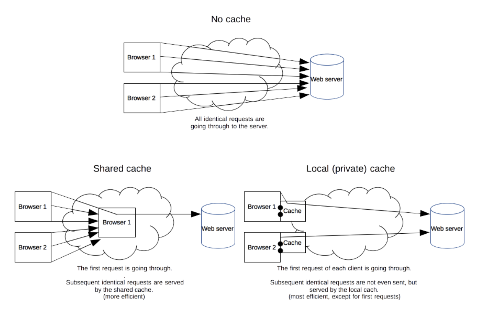

# HTTP Caching

[MDN](https://developer.mozilla.org/en-US/docs/Web/HTTP/Caching)

> The performance of web sites and applications can be significantly improved by reusing previously fetched resources. Web caches reduce latency and network traffic and thus lessen the time needed to display a representation of a resource. By making use of HTTP caching, Web sites become more responsive.

## Kinds of Caches



### Private Browser Caches

A browser cache holds all documents downloaded via [HTTP](https://developer.mozilla.org/en-US/docs/Web/HTTP) by the user. This cache is used to make visited documents available for back/forward navigation, saving, viewing-as-source, etc.

### Shared Proxy Caches

Caches stored in proxy for many users. (not automatic, proxy server need to be set). Reuse popular resources to reduce network traffic and latency.

## Controlling Caching

### No Caching

A request is sent to the server and a full response is downloaded each and every time.

```
Cache-Control: no-store
```

### Cache but Revalidate

A cache will send the request to the origin server for validation before releasing a cached copy.

```html
Cache-Control: no-cache
```

### Private

Response for single user only, mustn't be stored by a shared cache. Private browser cache.

```
Cache-Control: private
```

### Public

Can be cached by any cache (private or shared). Is useful for things that are not normally cacheable.

```html
Cache-Control: public
```

### Expiration

Maximum amount of time a resource will be considered fresh.

For files that don't usually change (static files like css, image, etc.).

```html
Cache-Control: max-age=31536000
```

### Validation

Must verify the status of the stale resources. Expired ones should not be used.

```html
Cache-Control: must-revalidate
```

## Freshness

Although cache can theoretically be stored forever, cache has finite storage so items are removed periodically from storage (**cache eviction**).

As HTTP is a client-server protocol, servers can't contact caches and clients when a resource changes; they have to communicate an expiration time for the resource. Before this expiration time, the resource is _fresh_; after the expiration time, the resource is _stale_.

Note that a stale resource is not evicted or ignored; when the cache receives a request for a stale resource, it forwards this request with a [`If-None-Match`](https://developer.mozilla.org/en-US/docs/Web/HTTP/Headers/If-None-Match) to check if it is in fact still fresh. If so, the server returns a [`304`](https://developer.mozilla.org/en-US/docs/Web/HTTP/Status/304) (Not Modified) header without sending the body of the requested resource, saving some bandwidth.


Freshness lifetime is calculated based on several headers.

**Formula:**

```html
expirationTime = responseTime + freshnessLifetime - currentAge
```

See [MDN](https://developer.mozilla.org/en-US/docs/Web/HTTP/Caching) for details.

## Revved Resources

JavaScript and CSS files change infrequently, but when they change you want them to be updated quickly. It's not efficient to rely only on expiration time (freshness).

**Solution: revving**

Infrequently updated files are named in a specific way: in their URL, usually in the filename, a revision (or version) number is added.

each new revision of this resource is considered as a resource on its own that _never_ changes and that can have an expiration time very far in the future, usually one year or even more.

All links to the new version files need to be changed. **Drawback:** additional complexity that is usually taken care of by the tool chain used by Web developers. A new version of one infrequently changed file can induce an addtional change (new versions) to other often variable resources.

**Benefit:** Updating 2 cached resources at the same time will not lead to


