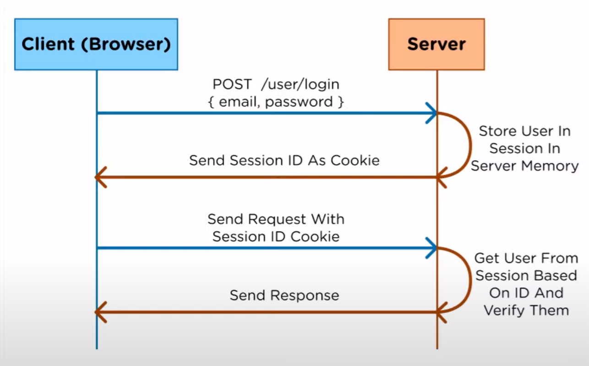
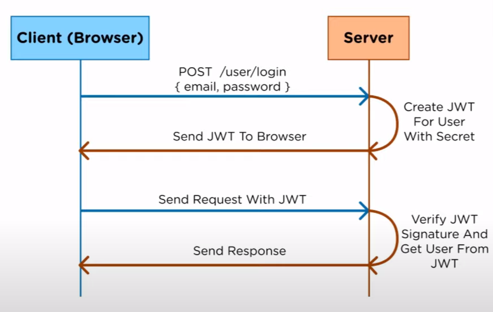
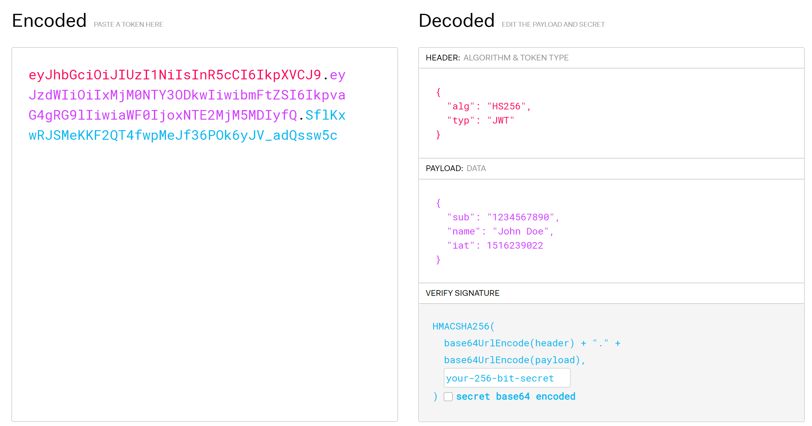

# Json Web Token

> Used for Authentication in a different way from Session Cookie.

[Playground](https://jwt.io/)

## How it Works

### Session Cookie

### JWT

A expire date should be set in the payload of the token for security reasons.

A secret key is needed for verifying a JWT.

### How is JWT Verified

A **JWT** consists of 3 parts:

- Header
- Payload
- Verify Signature

They are separated by dot (.) in the token.

The first 2 parts are just base64 encoded.

The 3rd part is used for Verification. As the figure shows, is generated by hashing the combination of encoded Header and Payload with a secret key.

To verify the token, the server can simply hash the first 2 parts (red+purple) again with the secret key and compare the result with the 3rd part (blue).

## Difference

With JWT, the server doesn't need to store session id in its memory. All user info related to authentication are stored within the JWT.

## Advantage

A single token can be used across multiple servers when with Session Cookie, memory between servers are not shared.

## Reference

### Video

[What Is JWT and Why Should You Use JWT](https://www.youtube.com/watch?v=7Q17ubqLfaM&ab_channel=WebDevSimplified)
