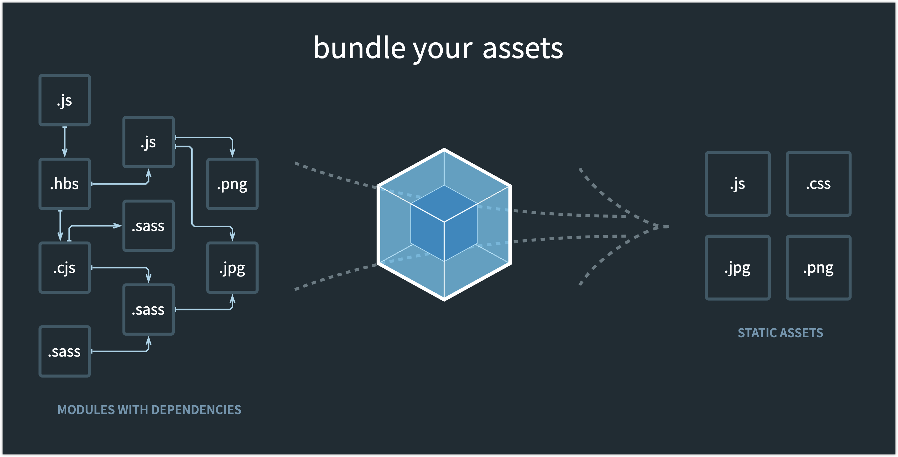

# webpack

https://webpack.js.org/

An image is worth 1000 words, the image on webpack's website could give you a very good idea of what webpack is.



# Sample Configuration

The following configuration is a simple sample for building a TypeScript project.

```js
const path = require("path");
// const BundleAnalyzerPlugin =
//   require("webpack-bundle-analyzer").BundleAnalyzerPlugin;

module.exports = {
  entry: "./src/index.ts",
  devtool: "inline-source-map",
  module: {
    rules: [
      {
        test: /\.tsx?$/,
        use: "ts-loader",
        exclude: /node_modules/,
      },
    ],
  },
  resolve: {
    extensions: [".tsx", ".ts", ".js"],
  },
  output: {
    filename: "index.cjs",
    path: path.resolve(__dirname, "dist"),
    chunkFormat: "commonjs",
  },
  // plugins: [new BundleAnalyzerPlugin()],
};
```
