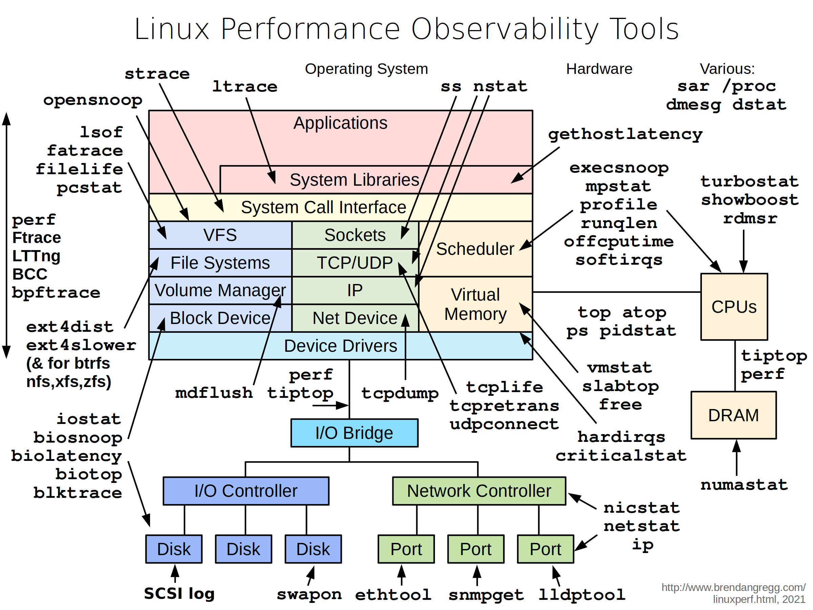

# Netshoot

## nicolaka/netshoot

[Docker Hub](https://hub.docker.com/r/nicolaka/netshoot)
[GitHub](https://github.com/nicolaka/netshoot)

A docker image with plenty of pre-installed tools for troubleshooting networks.
Tools include, iperf, nmap, socat, strace, tcpdump, tshark, vim and much more. Read the Docs for a full list.

## Usage

The Docs contain some sample code for different tools.
Simply start a container and attach it to the network you are toubleshooting.

## Reference

- [Docker Hub](https://hub.docker.com/r/nicolaka/netshoot)
- [GitHub](https://github.com/nicolaka/netshoot)
