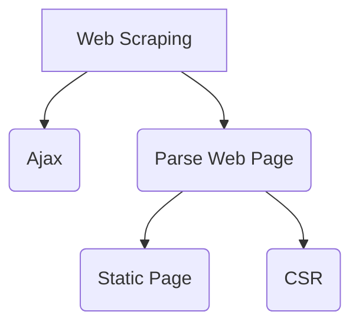
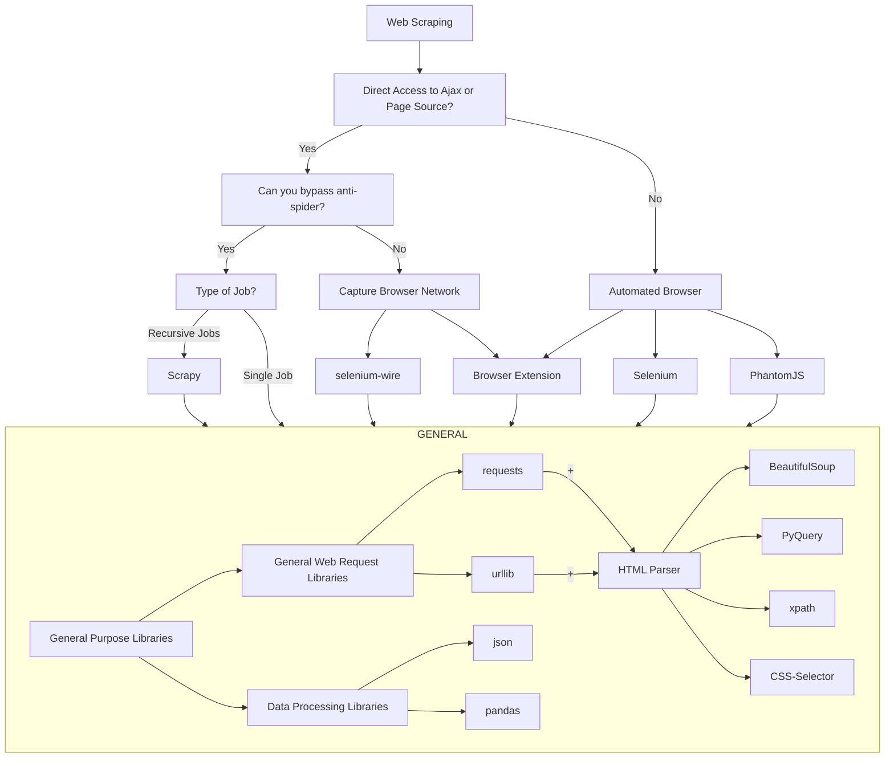

# Web Scraping

## Introduction

There are 2 main ways to scrape data

1. Ajax (json or html or other format, mostly json)
2. Parse Web Page directly (html)
   1. Static Page
   2. Client Side Rendered Page (with automated browser)

## Tech Stack Cheatsheet

## CSR (Client-Side-Rendering)

CSR(Client-Side-Rendering) web pages are harder to scrape because you have to render the page with some tool similar to a browser first before you can parse page content. Selenium is a tool that can render web pages. This makes the scraping process more complicated and time consuming because loading a web page requires downloading all resources the website needs and wait for the page to be rendered. Sending a single XHR (Ajax) request give us the data directly without needing to download unnecessary files and rendering them.

There is also benefit of using tools like selenium. It can bypass almost all anti-spider mechanism because it performs just like a real human being. User can even login with it in an automated way through regular login pages and do not need to worry about sessions, cookies or tokens for anti-spider. p.s. You still need to handle the CAPTCHA human verification on some websites which implemented this.

# Reference

- [崔庆才 Python 爬虫教程](https://cuiqingcai.com/)
